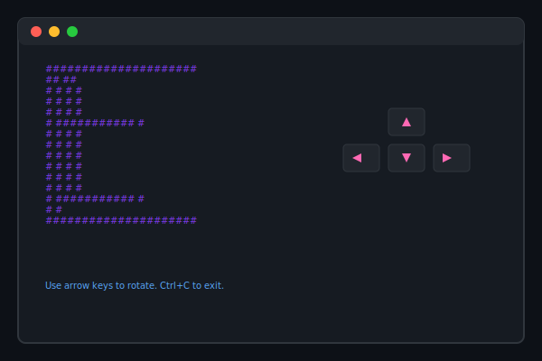

a 3D wireframe cube that spins in your terminal, built in pure rust.

use your arrow keys to form/rotate the cube and CTRL + C to exit the program



## Run it
```bash
git clone https://github.com/yourusername/3d-ascii-cube.git

cd 3d-ascii-cube

cargo run
```


